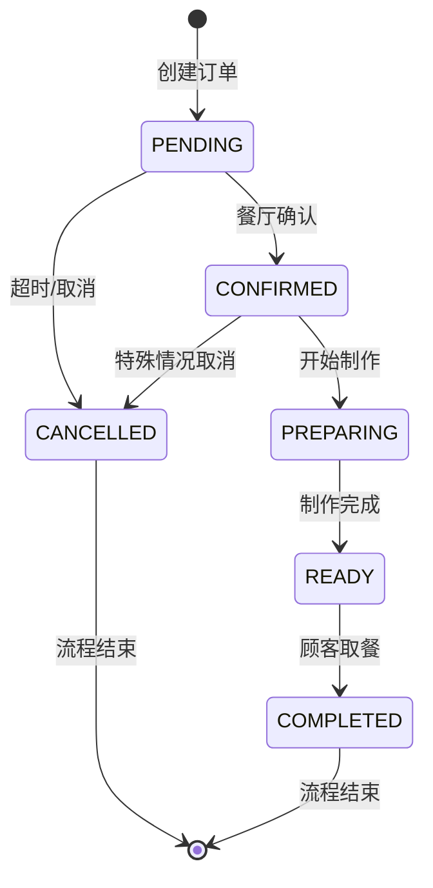
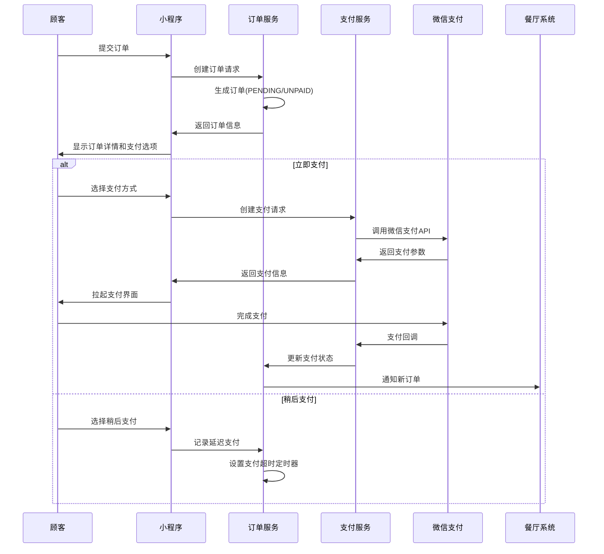

# 订单状态管理与支付流程设计文档

## 概述

本文档详细设计了餐厅点餐系统中的订单状态管理和支付流程。基于现有的系统架构，设计了完整的订单生命周期管理、支付时机控制和状态流转机制。

## 核心组件设计

### 1. 订单状态管理器 (OrderStatusManager)

**职责：** 控制订单状态的流转和验证

**状态定义：**
```java
public enum OrderStatus {
    PENDING("待确认"),
    CONFIRMED("已确认"), 
    PREPARING("制作中"),
    READY("制作完成"),
    COMPLETED("已完成"),
    CANCELLED("已取消");
}

public enum PaymentStatus {
    UNPAID("未支付"),
    PAID("已支付"),
    REFUNDED("已退款"),
    REFUNDING("退款中");
}
```

**状态流转规则：**


### 2. 支付流程控制器 (PaymentFlowController)

**支付时机设计：**

1. **订单创建后立即支付（推荐）**
   - 顾客提交订单 → 创建订单（PENDING状态）→ 立即跳转支付页面
   - 支付成功 → 更新支付状态为PAID → 通知餐厅确认
   - 支付失败 → 保持UNPAID状态 → 允许重新支付

2. **延迟支付选项**
   - 顾客可选择"稍后支付"
   - 设置支付超时时间（建议15分钟）
   - 超时未支付自动取消订单

**支付流程图：**


### 3. 订单详情页面数据模型

**前端数据结构：**
```javascript
const orderDetail = {
  // 基本信息
  id: "订单ID",
  orderNo: "订单号",
  tableId: "桌台ID", 
  tableName: "桌台名称",
  
  // 状态信息
  status: "订单状态码",
  statusDescription: "状态描述",
  paymentStatus: "支付状态码", 
  paymentStatusDescription: "支付状态描述",
  paymentMethod: "支付方式",
  
  // 金额信息
  totalAmount: "订单总金额",
  paidAmount: "实付金额",
  
  // 时间信息
  createdAt: "下单时间",
  paymentTime: "支付时间", 
  estimatedTime: "预计完成时间",
  completedTime: "实际完成时间",
  
  // 其他信息
  remarks: "备注",
  cancelReason: "取消原因",
  
  // 订单商品
  items: [
    {
      dishId: "菜品ID",
      dishName: "菜品名称", 
      dishImage: "菜品图片",
      dishPrice: "菜品单价",
      quantity: "数量",
      subtotal: "小计",
      specialRequests: "特殊要求"
    }
  ]
}
```

### 4. 状态显示逻辑设计

**状态文本映射：**
```javascript
const statusTextMap = {
  'PENDING': '待确认',
  'CONFIRMED': '已确认',
  'PREPARING': '制作中', 
  'READY': '制作完成',
  'COMPLETED': '已完成',
  'CANCELLED': '已取消'
}

const paymentStatusTextMap = {
  'UNPAID': '未支付',
  'PAID': '已支付',
  'REFUNDED': '已退款',
  'REFUNDING': '退款中'
}
```

**状态颜色设计：**
```css
.status-pending { color: #ff9500; }    /* 橙色 - 待确认 */
.status-confirmed { color: #007aff; }   /* 蓝色 - 已确认 */
.status-preparing { color: #007aff; }   /* 蓝色 - 制作中 */
.status-ready { color: #34c759; }       /* 绿色 - 制作完成 */
.status-completed { color: #8e8e93; }   /* 灰色 - 已完成 */
.status-cancelled { color: #ff3b30; }   /* 红色 - 已取消 */

.payment-unpaid { color: #ff9500; }     /* 橙色 - 未支付 */
.payment-paid { color: #34c759; }       /* 绿色 - 已支付 */
.payment-refunded { color: #8e8e93; }   /* 灰色 - 已退款 */
```

### 5. 时间显示逻辑

**时间格式化规则：**
```javascript
// 时间显示逻辑
function formatOrderTime(timeStr, label) {
  if (!timeStr) {
    return `${label}: --`
  }
  
  const time = new Date(timeStr)
  const now = new Date()
  const diff = now - time
  
  // 如果是今天，显示时分
  if (time.toDateString() === now.toDateString()) {
    return `${label}: ${time.getHours().toString().padStart(2, '0')}:${time.getMinutes().toString().padStart(2, '0')}`
  }
  
  // 如果不是今天，显示月日时分
  return `${label}: ${(time.getMonth() + 1).toString().padStart(2, '0')}-${time.getDate().toString().padStart(2, '0')} ${time.getHours().toString().padStart(2, '0')}:${time.getMinutes().toString().padStart(2, '0')}`
}

// 预计完成时间特殊处理
function formatEstimatedTime(estimatedTime, orderStatus) {
  if (!estimatedTime) return '预计完成: --'
  
  const estimated = new Date(estimatedTime)
  const now = new Date()
  
  if (orderStatus === 'COMPLETED') {
    return '已完成'
  }
  
  if (orderStatus === 'CANCELLED') {
    return '已取消'
  }
  
  if (estimated > now) {
    const diffMinutes = Math.ceil((estimated - now) / (1000 * 60))
    return `预计完成: 还需${diffMinutes}分钟`
  } else {
    return '预计完成: 即将完成'
  }
}
```

## 接口设计

### 1. 订单详情接口优化

**响应数据增强：**
```json
{
  "success": true,
  "data": {
    "id": 1949414745765404673,
    "orderNo": "ORD20250727182108887",
    "tableId": 2,
    "tableName": "T002",
    "status": "PENDING",
    "statusDescription": "待确认",
    "paymentStatus": "UNPAID", 
    "paymentStatusDescription": "未支付",
    "paymentMethod": null,
    "totalAmount": 55.00,
    "paidAmount": null,
    "createdAt": "2025-07-27T18:21:08",
    "paymentTime": null,
    "estimatedTime": "2025-07-27T18:51:08",
    "completedTime": null,
    "remarks": null,
    "cancelReason": null,
    "canCancel": true,
    "canPay": true,
    "items": [...]
  }
}
```

### 2. 支付相关接口

**创建支付接口：**
```
POST /api/payments
{
  "orderId": 1949414745765404673,
  "paymentMethod": "WECHAT",
  "amount": 55.00
}
```

**支付状态查询接口：**
```
GET /api/payments/order/{orderId}
```

## 错误处理

### 1. 状态流转异常

**异常场景：**
- 订单状态不允许的操作
- 支付状态与订单状态不匹配
- 并发状态更新冲突

**处理策略：**
```java
@Service
public class OrderStatusValidator {
    
    public void validateStatusTransition(OrderStatus from, OrderStatus to) {
        if (!isValidTransition(from, to)) {
            throw new BusinessException("订单状态不允许从" + from + "变更为" + to);
        }
    }
    
    public void validatePaymentOperation(OrderStatus orderStatus, PaymentStatus paymentStatus) {
        if (orderStatus == OrderStatus.CANCELLED && paymentStatus == PaymentStatus.PAID) {
            throw new BusinessException("已取消的订单不能进行支付操作");
        }
    }
}
```

### 2. 支付异常处理

**超时处理：**
- 支付超时自动取消订单
- 释放库存
- 通知用户

**重复支付处理：**
- 幂等性检查
- 防止重复扣款
- 状态一致性保证

## 性能优化

### 1. 缓存策略

**订单状态缓存：**
```java
@Cacheable(value = "order_status", key = "#orderId")
public OrderStatus getOrderStatus(Long orderId) {
    return orderRepository.findStatusById(orderId);
}
```

### 2. 实时通知优化

**WebSocket连接管理：**
- 按桌台分组管理连接
- 订单状态变更时精准推送
- 连接断开重连机制

## 安全考虑

### 1. 支付安全

**支付验证：**
- 订单金额校验
- 支付签名验证
- 防重放攻击

### 2. 状态操作权限

**权限控制：**
- 顾客只能查看自己的订单
- 服务员可以确认和更新订单状态
- 管理员可以执行所有操作