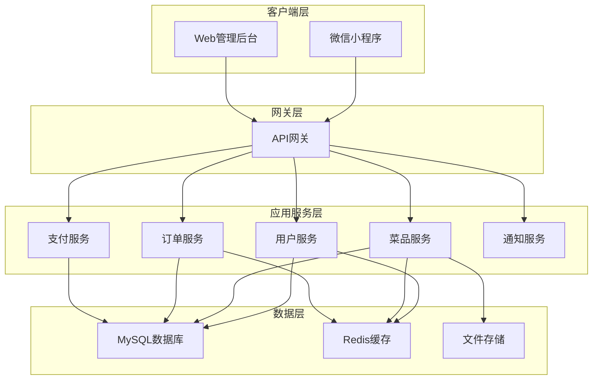
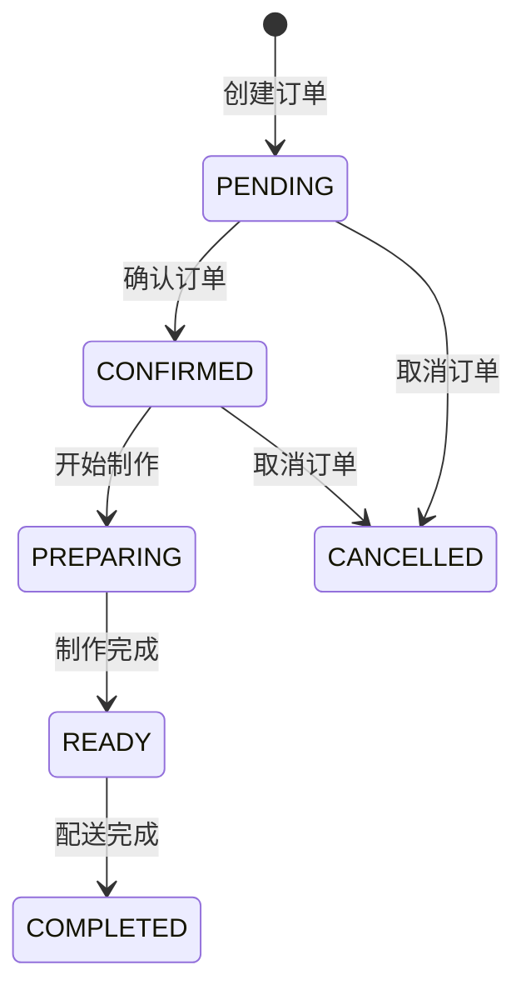
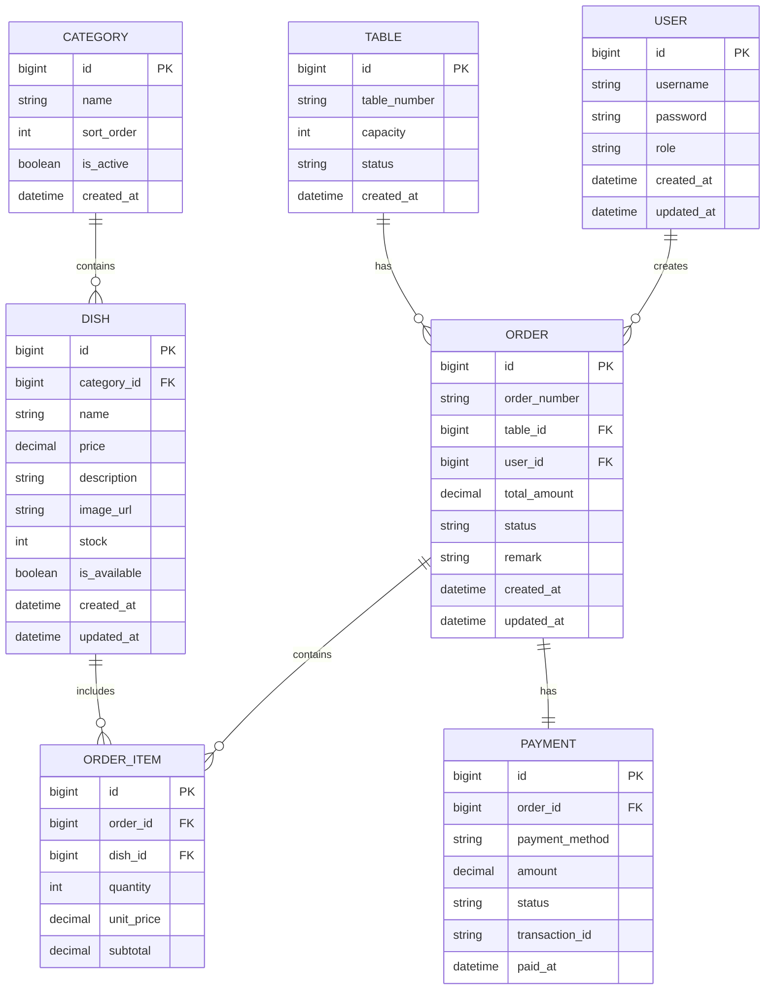

# 饭店点餐系统设计文档

## 概述

饭店点餐系统是一个分布式的餐饮管理解决方案，包含Web后台管理系统和微信小程序客户端。系统采用前后端分离架构，支持实时订单处理、库存管理和数据分析功能。

## 系统架构

### 整体架构



### 技术栈选择

**后端技术栈：**
- 框架：Spring Boot 2.7+
- 数据库：MySQL 8.0
- 缓存：Redis 6.0
- 消息队列：RabbitMQ
- 文件存储：阿里云OSS
- 支付：微信支付API

**前端技术栈：**
- 小程序：微信小程序原生开发
- 管理后台：Vue.js 3 + Element Plus
- 状态管理：Vuex/Pinia
- HTTP客户端：Axios

## 核心组件和接口

### 1. 用户认证服务 (AuthService)

**职责：** 处理用户登录、权限验证和会话管理

**核心接口：**
```java
public interface AuthService {
    LoginResponse login(LoginRequest request);
    void logout(String token);
    boolean validateToken(String token);
    UserInfo getCurrentUser(String token);
    boolean hasPermission(String userId, String permission);
}
```

**权限模型：**
- 管理员：所有功能权限
- 服务员：订单管理、桌台管理权限
- 厨师：订单查看、状态更新权限

### 2. 菜品管理服务 (MenuService)

**职责：** 管理菜品信息、分类和库存

**核心接口：**
```java
public interface MenuService {
    List<Category> getCategories();
    List<Dish> getDishesByCategory(Long categoryId);
    Dish createDish(CreateDishRequest request);
    Dish updateDish(Long dishId, UpdateDishRequest request);
    void deleteDish(Long dishId);
    void updateStock(Long dishId, Integer stock);
}
```

**数据同步策略：**
- 使用Redis缓存热门菜品数据
- 菜品更新时通过WebSocket推送到小程序
- 库存变更实时同步

### 3. 订单管理服务 (OrderService)

**职责：** 处理订单创建、状态管理和流程控制

**核心接口：**
```java
public interface OrderService {
    Order createOrder(CreateOrderRequest request);
    Order updateOrderStatus(Long orderId, OrderStatus status);
    List<Order> getOrdersByTable(Long tableId);
    List<Order> getOrdersByStatus(OrderStatus status);
    void cancelOrder(Long orderId, String reason);
}
```

**订单状态流转：**


### 4. 支付服务 (PaymentService)

**职责：** 处理支付流程和交易记录

**核心接口：**
```java
public interface PaymentService {
    PaymentResponse createPayment(PaymentRequest request);
    PaymentStatus queryPaymentStatus(String paymentId);
    void handlePaymentCallback(PaymentCallback callback);
    RefundResponse refund(RefundRequest request);
}
```

**支付流程：**
1. 创建支付订单
2. 调用微信支付API
3. 处理支付回调
4. 更新订单状态
5. 发送支付通知

### 5. 实时通知服务 (NotificationService)

**职责：** 处理实时消息推送和通知

**核心接口：**
```java
public interface NotificationService {
    void sendOrderNotification(Long orderId, NotificationType type);
    void sendSystemNotification(String message, List<String> userIds);
    void subscribeOrderUpdates(String userId, Long orderId);
}
```

**通知渠道：**
- WebSocket：实时订单状态更新
- 微信模板消息：重要通知推送
- 系统内消息：管理后台通知

## 数据模型

### 核心实体关系



### 数据库设计要点

**索引策略：**
- 订单表：order_number, table_id, status, created_at
- 菜品表：category_id, is_available
- 用户表：username (唯一索引)

**分区策略：**
- 订单表按月分区，提高查询性能
- 支付记录表按季度分区

## 错误处理

### 错误分类和处理策略

**业务错误：**
- 菜品库存不足：返回具体错误信息，建议替代菜品
- 桌台不存在：提示重新选择桌台
- 订单状态异常：不允许操作并说明原因

**系统错误：**
- 数据库连接失败：启用降级服务，使用缓存数据
- 支付接口异常：记录错误日志，提供重试机制
- 网络超时：自动重试3次，超时后返回友好提示

**错误响应格式：**
```json
{
    "success": false,
    "errorCode": "DISH_OUT_OF_STOCK",
    "message": "菜品库存不足",
    "data": {
        "dishId": 123,
        "availableStock": 0,
        "suggestedDishes": [...]
    }
}
```

### 异常监控和告警

- 使用ELK Stack收集和分析日志
- 关键业务指标监控（订单成功率、支付成功率）
- 异常情况自动告警（短信、邮件、钉钉）

## 测试策略

### 测试层次

**单元测试：**
- 覆盖率要求：80%以上
- 重点测试业务逻辑和数据处理
- 使用JUnit 5 + Mockito

**集成测试：**
- API接口测试：使用Postman/Newman
- 数据库集成测试：使用TestContainers
- 消息队列集成测试

**端到端测试：**
- 小程序自动化测试：使用微信开发者工具
- Web后台测试：使用Selenium
- 关键业务流程测试

### 性能测试

**负载测试场景：**
- 并发点餐：模拟100个用户同时下单
- 菜单浏览：模拟500个用户同时浏览菜单
- 订单查询：模拟200个用户同时查询订单状态

**性能指标要求：**
- 响应时间：95%的请求在2秒内完成
- 吞吐量：支持1000 TPS
- 可用性：99.9%

### 安全测试

**安全检查项：**
- SQL注入防护
- XSS攻击防护
- CSRF攻击防护
- 敏感数据加密
- API访问频率限制

**数据安全：**
- 用户密码使用BCrypt加密
- 支付信息使用AES加密
- 敏感日志脱敏处理
- 定期安全漏洞扫描