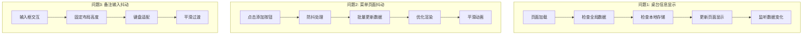

# 小程序UI修复设计文档

## 概述

本设计文档针对餐厅点餐小程序中的三个具体UI问题提供技术解决方案。这些修复将确保用户界面的稳定性和一致性，同时不影响现有的业务逻辑和功能。

## 架构

### 问题分析

通过代码分析，发现了以下问题根源：

1. **桌台信息显示问题**: 购物车页面的`loadTableInfo()`方法可能在页面数据更新时机上存在问题
2. **菜单页面抖动问题**: 添加商品时的DOM更新和数据同步可能导致页面重新渲染
3. **备注输入抖动问题**: 输入框焦点变化和键盘弹出可能导致页面布局调整

### 技术方案架构



## 核心组件和接口

### 1. 桌台信息管理优化

**问题根源分析:**
- `loadTableInfo()`方法在页面生命周期中调用时机不当
- 全局数据和本地存储的同步问题
- 页面显示状态更新不及时

**解决方案:**
```javascript
// 优化后的桌台信息加载逻辑
loadTableInfo() {
  // 优先从全局数据获取
  let tableId = app.globalData.tableId;
  let tableName = app.globalData.tableName;
  
  // 如果全局数据为空，从本地存储获取
  if (!tableId) {
    tableId = wx.getStorageSync('tableId');
    tableName = wx.getStorageSync('tableName');
    
    // 同步到全局数据
    if (tableId) {
      app.globalData.tableId = tableId;
      app.globalData.tableName = tableName;
    }
  }
  
  // 更新页面数据
  this.setData({
    'tableInfo.id': tableId,
    'tableInfo.name': tableName || '未选择桌台'
  });
}
```

**生命周期优化:**
- 在`onLoad`、`onShow`和`onReady`中都调用桌台信息检查
- 添加数据变化监听机制

### 2. 菜单页面渲染优化

**问题根源分析:**
- `addToCart`方法中多次调用`setData`导致频繁渲染
- `updateDishCartQuantity`方法遍历整个菜品列表更新数据
- 缺少防抖机制

**解决方案:**
```javascript
// 优化后的添加到购物车逻辑
addToCart(e) {
  const dish = e.currentTarget.dataset.dish;
  
  // 防抖处理
  if (this.addToCartTimer) {
    clearTimeout(this.addToCartTimer);
  }
  
  this.addToCartTimer = setTimeout(() => {
    this.performAddToCart(dish);
  }, 100);
}

performAddToCart(dish) {
  // 批量更新数据，减少setData调用
  const updates = {};
  
  // 更新购物车数据
  const cart = app.globalData.cart || [];
  const existingItem = cart.find(item => item.dishId === dish.id);
  
  if (existingItem) {
    existingItem.quantity += 1;
  } else {
    cart.push({
      dishId: dish.id,
      dishName: dish.name,
      price: dish.price,
      image: dish.image,
      quantity: 1,
      specialRequests: ''
    });
  }
  
  // 更新特定菜品的数量显示
  const dishIndex = this.data.dishes.findIndex(d => d.id === dish.id);
  if (dishIndex !== -1) {
    updates[`dishes[${dishIndex}].cartQuantity`] = existingItem ? existingItem.quantity : 1;
  }
  
  // 更新购物车总数
  updates.cartCount = this.calculateCartCount(cart);
  
  // 一次性更新所有数据
  this.setData(updates);
  
  // 更新全局数据
  app.globalData.cart = cart;
  wx.setStorageSync('cart', cart);
}
```

**CSS优化:**
```css
/* 添加过渡动画，减少视觉跳动 */
.cart-controls {
  transition: all 0.2s ease-in-out;
}

.quantity {
  transition: all 0.2s ease-in-out;
  min-width: 40rpx;
  text-align: center;
}

/* 固定按钮尺寸，避免布局变化 */
.cart-btn {
  width: 60rpx;
  height: 60rpx;
  flex-shrink: 0;
}
```

### 3. 备注输入框优化

**问题根源分析:**
- 输入框高度变化导致页面布局调整
- 键盘弹出时页面滚动位置变化
- 缺少平滑过渡效果

**解决方案:**
```javascript
// 优化后的备注输入处理
onRemarksInput(e) {
  // 防抖处理输入
  if (this.remarksInputTimer) {
    clearTimeout(this.remarksInputTimer);
  }
  
  this.remarksInputTimer = setTimeout(() => {
    this.setData({
      remarks: e.detail.value
    });
  }, 300);
}

// 添加输入框焦点处理
onRemarksFocus() {
  // 固定页面滚动位置，避免跳动
  this.setData({
    inputFocused: true
  });
}

onRemarksBlur() {
  this.setData({
    inputFocused: false
  });
}
```

**WXML结构优化:**
```xml
<!-- 固定高度的备注区域 -->
<view class="remarks-section">
  <view class="remarks-label">订单备注</view>
  <view class="remarks-input-container">
    <textarea 
      class="remarks-input {{inputFocused ? 'focused' : ''}}" 
      placeholder="请输入订单备注（选填）" 
      value="{{remarks}}" 
      bindinput="onRemarksInput"
      bindfocus="onRemarksFocus"
      bindblur="onRemarksBlur"
      maxlength="200"
      fixed="true">
    </textarea>
  </view>
</view>
```

**CSS优化:**
```css
/* 固定备注区域高度 */
.remarks-section {
  min-height: 200rpx;
  transition: all 0.3s ease-in-out;
}

.remarks-input-container {
  position: relative;
  min-height: 120rpx;
}

.remarks-input {
  width: 100%;
  min-height: 120rpx;
  max-height: 200rpx;
  padding: 20rpx;
  border: 1rpx solid #ddd;
  border-radius: 12rpx;
  font-size: 26rpx;
  background-color: #f8f9fa;
  transition: all 0.3s ease-in-out;
  resize: none;
}

.remarks-input.focused {
  border-color: #ff6b35;
  background-color: white;
}

/* 键盘适配 */
.container {
  padding-bottom: 200rpx;
  transition: padding-bottom 0.3s ease-in-out;
}
```

## 数据模型

### 状态管理优化

**全局数据结构保持不变:**
```javascript
globalData: {
  userInfo: null,
  token: null,
  baseUrl: 'http://192.168.0.104:8080',
  tableId: null,
  tableName: null,
  cart: [],
  orderInfo: null
}
```

**页面级数据优化:**
```javascript
// 购物车页面数据结构
data: {
  cartItems: [],
  totalPrice: 0,
  totalCount: 0,
  tableInfo: {
    id: null,
    name: ''
  },
  remarks: '',
  submitting: false,
  inputFocused: false  // 新增：输入框焦点状态
}

// 菜单页面数据结构
data: {
  categories: [],
  dishes: [],
  currentCategoryId: null,
  searchKeyword: '',
  loading: false,
  cartCount: 0,
  showSearch: false,
  page: 1,
  hasMore: true,
  addToCartTimer: null  // 新增：防抖定时器
}
```

## 错误处理

### 桌台信息错误处理
- 如果全局数据和本地存储都没有桌台信息，显示选择桌台提示
- 如果桌台信息格式错误，重置为默认状态
- 添加桌台信息验证逻辑

### 渲染性能错误处理
- 如果`setData`调用过于频繁，使用防抖机制
- 如果数据更新失败，回滚到之前状态
- 添加渲染异常捕获和恢复机制

### 输入框错误处理
- 如果输入内容超出限制，自动截断
- 如果键盘适配失败，提供备用方案
- 添加输入验证和错误提示

## 测试策略

### 功能测试
1. **桌台信息显示测试**
   - 测试有桌台信息时的正确显示
   - 测试无桌台信息时的提示显示
   - 测试桌台信息更新时的实时反映

2. **菜单页面稳定性测试**
   - 测试快速连续点击添加按钮
   - 测试大量菜品数据下的性能
   - 测试购物车数量更新的视觉效果

3. **备注输入测试**
   - 测试输入框焦点变化
   - 测试键盘弹出和收起
   - 测试长文本输入

### 性能测试
- 页面渲染性能测试
- 内存使用情况监控
- 用户交互响应时间测试

### 兼容性测试
- 不同微信版本兼容性
- 不同设备屏幕尺寸适配
- iOS和Android平台测试